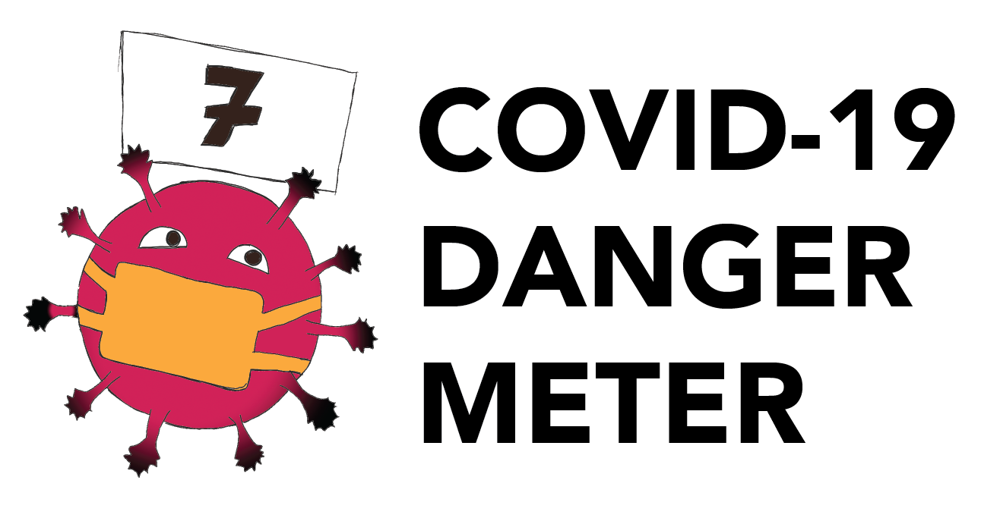

# Use your head and stop the spread!

## Project
This project is our submission for HackMIT 2020.

We developed a web application to analyze crowdsourced, geotagged images to determine whether people are following COVID-19 public safety guidelines at different locations. Based on metrics detected from the image including how many people are wearing masks, the app provides a score for how safe a location is. The map view shows the distribution of where there is the highest risk of spreading COVID-19, and provides an intuitive visualization for infraction hotspots. This helps better inform both the public and law enforcement of public health risks. 

## Technology Stack
The image processing aspect of this project uses PyTorch FasterRCNN to find masks, TensorFlow implementation of YOLO to identify faces (pretrained), and OpenCV. We then pinpoint overlap between faces and masks as identified by the articial intelligence algorithms and use this, along with the environment, to generate a COVID safety score. In the future, this safety score will be written to a database along with the user's latitude and longitude.

Using the data stored in the database, we also have a visualization component to help users figure out whether a location is safe. There is both a clustered leaflet plot to show the scores of individual locations, built with Folium, while the overall concentration of infractions can be seen in the 3-D bar graph, which uses PyDeck.

Finally, the webapp for the project was created with a StreamLit backend. 

## Instructions

1. Upload a picture of a specific location in order to update the COVID Danger Scale application.
2. View the aggregated statistics on a map of your area in the View menu.

## Video Demo

